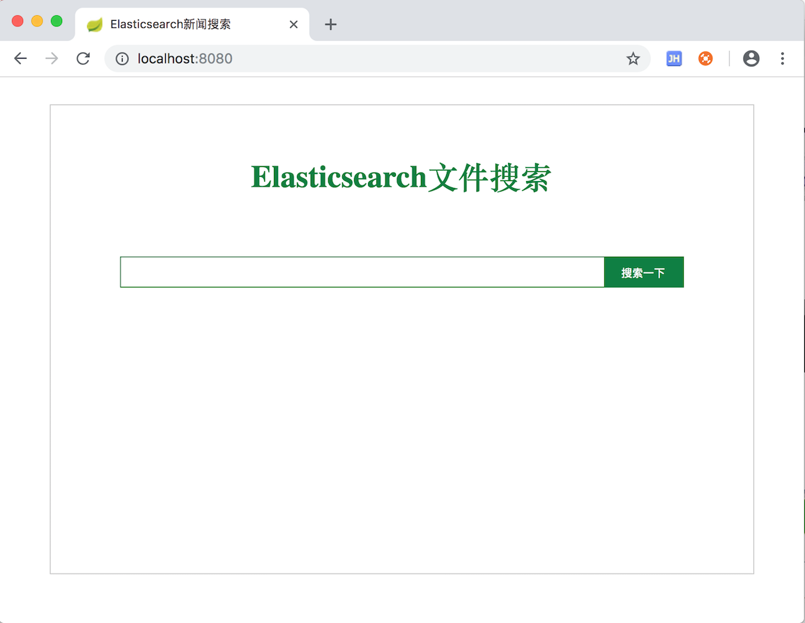

# 简介

Elasticsearch 实现文件检索。

# 搜索客户端

elasticsearch-rest-high-level-client

# 软件版本

| 名称          | 版本  |
| ------------- | ----- |
| Spring boot   | 2.0.5 |
| Elasticsearch | 6.3.2 |

# 运行方法

1. 启动Elasticsearch

2. 修改application.properties中的配置：

   ```properties
   elastic.search.host=127.0.0.1
   elastic.search.port=9200
   elastic.search.clusterName=elasticsearch
   ```

3. 启动
   运行`src/main/java/cn/pan/EsfilesearchApplication.java`中的main方法.
   

   启动时会从  `src/main/java/cn/pan/MyApplicationRunner.java`中初始化索引,把`src/main/resources/files`目录下的文件导入es.

   默认索引名为`userdoc`，类型名`file`，分片数为`3`，副本为`0`.

4. 访问http://localhost:8080

   首页:

   
   
   搜索(src/main/resources/files目录下文件名和内容含有的关键词做测试):

   
